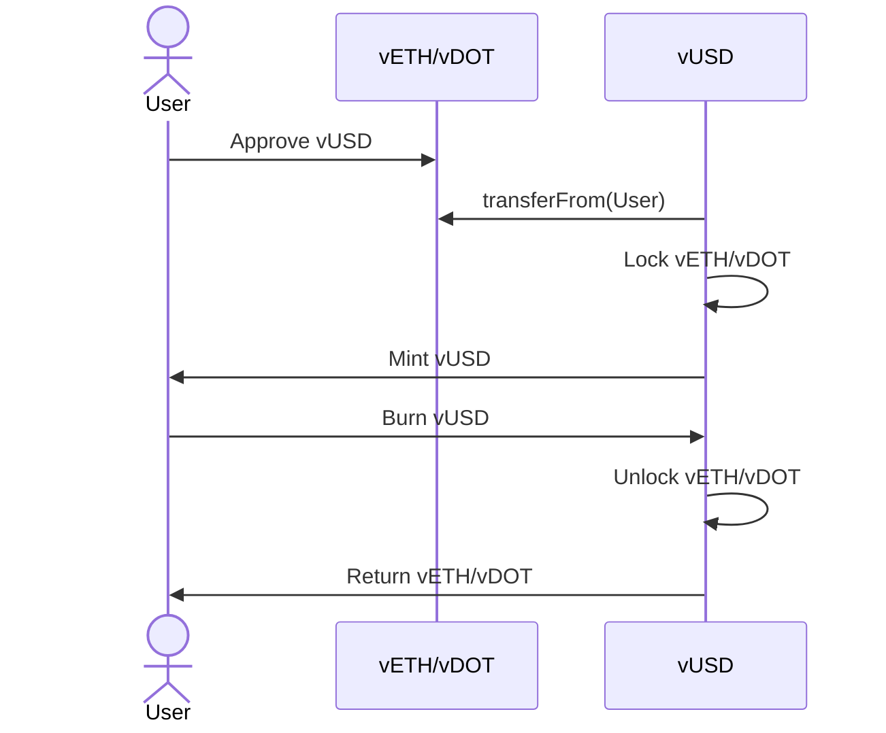

# vUSD Stablecoin

## Overview 

vUSD is a collateral-backed stablecoin implemented in Solidity. Users can lock supported collateral assets to mint vUSD, and later repay vUSD to unlock their collateral.


## Key Features

- **Collateral Locking**: Users lock approved collateral assets (e.g., vETH, vDOT).
- **Minting vUSD**: vUSD is minted based on:
    - Collateral price
    - A global collateral ratio
- **Unlocking Collateral**: Users can partially or fully unlock collateral by burning vUSD.
- **Management**: Prices, ratios, and allowed collateral are managed by the protocol owner.
- **Focus on Safety**: The project emphasizes correctness, test coverage, and protocol safety.

This repository serves as a platform for protocol design exploration.


## Prerequisites


This project uses [Foundry](https://foundry.paradigm.xyz/).

### Installation Steps

1. **Install Foundry**:
     ```bash
     curl -L https://foundry.paradigm.xyz | bash
     foundryup
     ```

2. **Install Dependencies**:
     ```bash
     forge install
     ```
###  Build and test

3. **Build the Project**:
     ```bash
     forge build
     ```

4. **Run Tests**:
     ```bash
     forge test
     ```

     For increased verbosity:
     ```bash
     forge test -vv
     ```


## Environment Variables For Deployment

1. Copy `.env.example` to `.env`:
   ```shell
   cp .env.example .env
   ```
2. Fill in the required values:
   - `RPC_URL` – Base Sepolia RPC endpoint (e.g., Alchemy/Infura)
   - `PRIVATE_KEY` – Deployer private key (0x-prefixed)
   - `ETHERSCAN_API_KEY` – Basescan/Etherscan API key for contract verification


### Deploy & Verify (Base Sepolia)

```shell
forge script script/DeployVUSD.s.sol:DeployVUSD \
  --rpc-url $RPC_URL \
  --private-key $PRIVATE_KEY \
  --broadcast \
  --verify \
  --verifier etherscan \
  --verifier-url "https://api.etherscan.io/v2/api?chainid=84532" \
  --etherscan-api-key $ETHERSCAN_API_KEY
```

### Deployed Contracts (Base Sepolia)

- Mock vETH: [0xAeD88bFC17C1700291FD8d59c155a377e79E16F7](https://sepolia.basescan.org/address/0xAeD88bFC17C1700291FD8d59c155a377e79E16F7)
- Mock vDOT: [0x135078823F9FaA95BB1761e02F4BE1D20fB56328](https://sepolia.basescan.org/address/0x135078823F9FaA95BB1761e02F4BE1D20fB56328)
- vUSD: [0xa873aafC84eef54Aee3c0b1705DEd9CB35Fb6715](https://sepolia.basescan.org/address/0xa873aafC84eef54Aee3c0b1705DEd9CB35Fb6715)

## Project Progress & Task Dashboard

Development tasks and feature progress are tracked publicly using GitHub Projects:

https://github.com/users/yehia67/projects/5

## Design Notes
All design notes for each iteration can be found [/docs/design-notes/](./docs/design-notes/)

## Inspiration

The protocol is inspired by Liquity-style systems, particularly the concept of overcollateralized debt positions with explicit accounting. However, there is **no direct dependency on Liquity code**; This is an independent implementation.

## License
This project is released under the [MIT License](./LICENSE).


