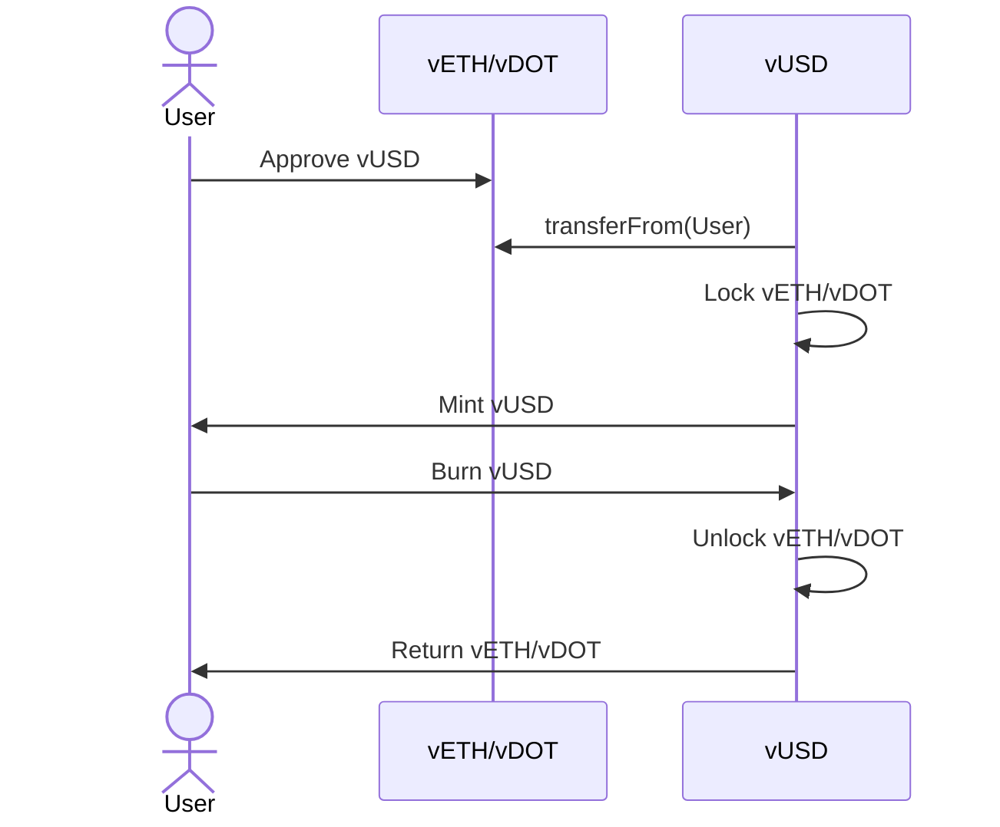

# vUSD Stablecoin

## Overview 

vUSD is a collateral-backed stablecoin implemented in Solidity. Users can lock supported collateral assets to mint vUSD, and later repay vUSD to unlock their collateral.


## Key Features

- **Collateral Locking**: Users lock approved collateral assets (e.g., vETH, vDOT).
- **Minting vUSD**: vUSD is minted based on:
    - Collateral price
    - A global collateral ratio
- **Unlocking Collateral**: Users can partially or fully unlock collateral by burning vUSD.
- **Management**: Prices, ratios, and allowed collateral are managed by the protocol owner.
- **Focus on Safety**: The project emphasizes correctness, test coverage, and protocol safety.

This repository serves as a platform for protocol design exploration.


## Prerequisites

This project uses [Foundry](https://foundry.paradigm.xyz/).

### Installation Steps

1. **Install Foundry**:
     ```bash
     curl -L https://foundry.paradigm.xyz | bash
     foundryup
     ```

2. **Install Dependencies**:
     ```bash
     forge install
     ```
###  Build and test

3. **Build the Project**:
     ```bash
     forge build
     ```

4. **Run Tests**:
     ```bash
     forge test
     ```

     For increased verbosity:
     ```bash
     forge test -vv
     ```

## Inspiration

The protocol is inspired by Liquity-style systems, particularly the concept of overcollateralized debt positions with explicit accounting. However, there is **no direct dependency on Liquity code**; This is an independent implementation.
